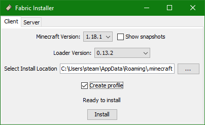

# MC 1.18.1 for long haired zombie brothers (java edition)
This is an installation guide on how to set up some mods, shader and resource packs for minecraft vanilla 1.18.1 to have less distracting visuals and more comfortable play experience.  
The behaviour of the base game is not changed so.

## Download and files

Get the archive: https://flauschhaus.org/downloads/zombies_mc_1181/fabric-installer.zip. The file is password protected.  

It holds the following files, so you can download it in one file:

| Filename                                               | Description                                              | URL                                                                           |
|--------------------------------------------------------|----------------------------------------------------------|-------------------------------------------------------------------------------|
| Client and server side                                 |                                                          |                                                                               |
| fabric-installer-0.10.2.exe                            | Installer of the fabric loader                           | https://fabricmc.net/use/installer/                                           |
| mods/fabric-api-0.46.4+1.18.jar                        | fabric API                                               | https://www.curseforge.com/minecraft/mc-mods/fabric-api                       |
| mods/lithium-fabric-mc1.18.1-0.7.7.jar                 | Optimization of game physics, mob AI, block ticking, etc | https://www.curseforge.com/minecraft/mc-mods/lithium                          |
| mods/phosphor-fabric-mc1.18.x-0.8.1.jar                | Optimization of lighting engine                          | https://www.curseforge.com/minecraft/mc-mods/phosphor                         |
| mods/ferritecore-4.1.1-fabric.jar                      | Optimization of memory consumption                       | https://www.curseforge.com/minecraft/mc-mods/ferritecore-fabric               |
| mods/XaerosWorldMap_1.20.3.1_Fabric_1.18.jar           | World map                                                | https://www.curseforge.com/minecraft/mc-mods/xaeros-world-map                 |
| Client side                                            |                                                          |                                                                               |
| mods/sodium-fabric-mc1.18.1-0.4.0-alpha6+build.14.jar  | Opimization of rendering engine (replaces OptiFine)      | https://www.curseforge.com/minecraft/mc-mods/sodium                           |
| mods/iris-mc1.18.1-1.2.0-pre.jar                       | Add Shader support                                       | https://www.curseforge.com/minecraft/mc-mods/irisshaders                      |
| mods/Xaeros_Minimap_22.2.0.1_Fabric_1.18.jar           | Mini map                                                 | https://www.curseforge.com/minecraft/mc-mods/xaeros-minimap                   |
| mods/wthit-fabric-4.5.1.jar                            | What The Hell Is That?                                   | https://www.curseforge.com/minecraft/mc-mods/wthit                            |
| shaderpacks/ComplementaryShaders_v4.3.3.zip            | Shader pack                                              | https://www.curseforge.com/minecraft/customization/complementary-shaders      |
| resourcepacks/Fantasy_Ores[1.16.x+to+1.18.x][v4.1].zip | Much better visible ores                                 | https://www.curseforge.com/minecraft/texture-packs/fantasy-ores-by-cesarzorak |

## Fabric Loader and API
We use fabric (https://fabricmc.net/) to improve many aspects of the minecraft engine without changing the user experience. Fabric provides in contrast to Forge (which is still very popular for quite some time now) a very modular API. This is the reason for having so many mods. They all optimize another aspect of the game engine.

### Installation of the fabric loader

If you use the **standard launcher** for the minecraft java edition (`Minecraft.exe`), **start it once before doing the installation**. This generates some files which could be necessary for the installer below.

The "most tricky" thing here is the "installation" of the fabric loader. On Windows you have to double-click the `fabric-installer-0.10.2.exe` and then cope with the consequences:

#### MultiMC

In the case of MultMC you have to select the minecraft folder of your instance here and **switch off** the "Create profile" check box. And "yes", you also have to do this for MultiMC, even if it has an own mechanism for installing the fabric loader.  
Back in MultiMC you go to "Edit instance" and click the "Install Fabric" on the "Version" tab (selected per default).

## Installation of the mods

Copy the `mods` folder from the archive downloaded above into the directory you chose above for the fabric loader installation.

## Installation of the shader pack(s)

Copy the `shaderpacks` folder from the archive downloaded above into the directory you chose above for the fabric loader installation.

## Installation of the resource pack(s)

Copy the `resourcepacks` folder from the archive downloaded above into the directory you chose above for the fabric loader installation.

## Activation of the shader pack

Start the game and choose the "Complementary shader pack" for the iris mod:  
  
  
  
  

Hit "Apply" or "Done" once you selected the shader pack.

## Improve mouse sensitivity

Set the mouse sensitivity to 140% for instance:  
  
  
  

Hit "Done" once you selected the sensitivity.

## Using the world map / mini map

The mini map on the top left can be configured in many ways. Hit the `m` key in game and click on the gear wheel button for the settings. 